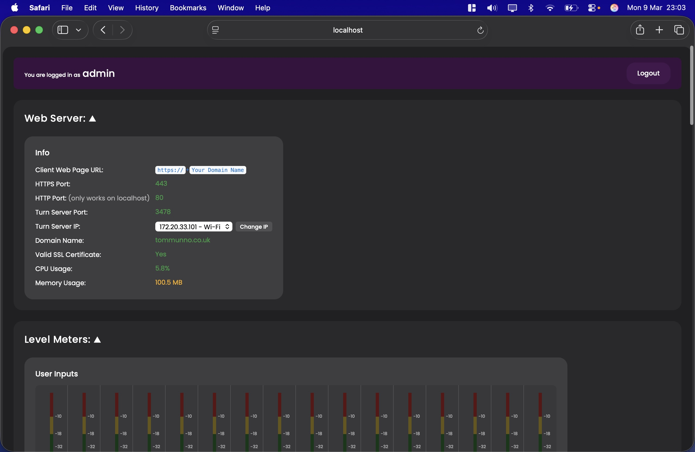
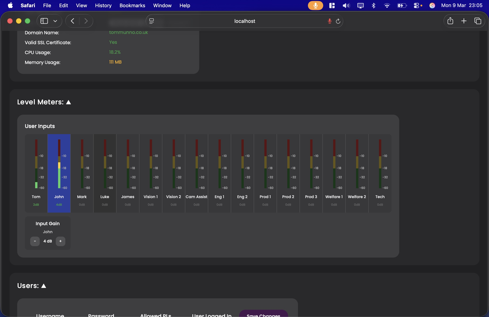
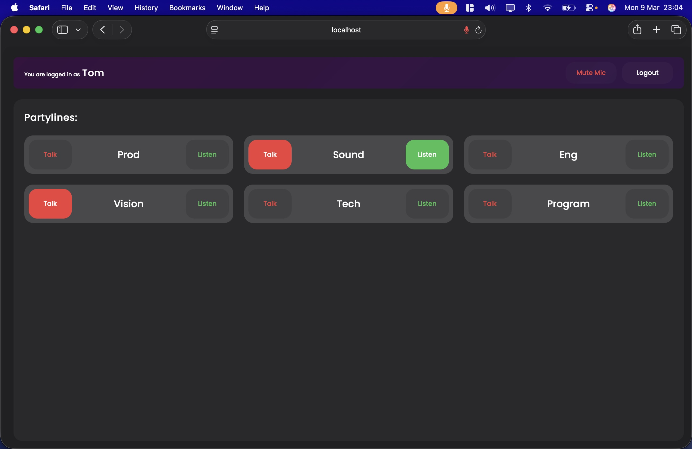
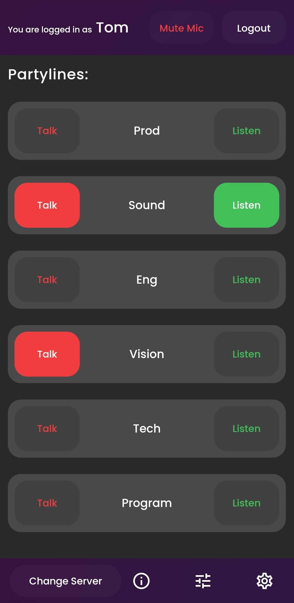

# Real-Time Broadcast Intercom

## Project highlights

- Real-time IP-based intercom platform for broadcast workflows
- Runs locally on a Mac, serving desktop and mobile clients via web and native apps
- Supports talk/listen communication across multiple partylines
- Node.js backend handling signalling, configuration, session management, and control
- WebSocket and WebRTC-based real-time communications stack
- Native C++ audio engine integrated with Node.js via N-API for low-latency audio mixing
- Audio matrix crosspoint logic for routing partyline audio
- Browser-based admin setup interface for managing users and system configuration
- Integration with professional soundcard devices for broadcast interoperability

This repository contains an early-stage TypeScript migration of the app and is still under active development. As such, not all functionality from the original version has been migrated yet, and some features are currently incomplete or subject to change. Please see the information below for the current stage of development.

## Images

Below are some images from the previous fully working version of the app, included as a reference while this TypeScript migration continues to evolve.

<table>
  <tr>
    <td align="center">
      <br>
      <sub>Setup page</sub>
    </td>
    <td align="center">
      <br>
      <sub>Level meters</sub>
    </td>
  </tr>
    <tr>
    <td align="center">
      <br>
      <sub>User keypanel</sub>
    </td>
    <td align="center">
      <br>
      <sub>Phone keypanel</sub>
    </td> 
    
  </tr>
</table>

## Prerequisites

Before running the app, make sure the following are installed:

- Node.js
- Python 3
- Xcode Command Line Tools

You can install Xcode Command Line Tools on macOS with:

```bash
xcode-select --install
```

## Quick start guide

_Please note: at present, the app is only supported on Apple silicon Macs. Other operating systems and architectures are not currently supported._

```bash
npm install
npm run build
npm start
```

The setup page will open automatically at `http://127.0.0.1:4321/setup` by default.

Default admin login credentials are:

**Username:** `admin`  
**Password:** `intercomadmin123`

Once logged in to the setup page, you can configure user credentials in the **Users** section. Clients can then log in by navigating to `https://<YOUR_SERVER_IP>:4322` by default.

Clients are required to connect via HTTPS. By default, a self-signed certificate is created. For production use, please add `server.cert` and `server.key` files into `/certs`.

At present, the app requires a soundcard with at least one input and one output. You may need to create an aggregate device in macOS’s Audio MIDI Setup to achieve this. The app currently maps your Mac’s soundcard channels one-to-one with the partyline channels.

To allow remote clients to connect, you can set up port forwarding for the HTTPS port, the HTTP port (optional, for HTTPS redirection), and eventually the TURN server port once TURN support has been implemented.

## What currently works

- User and admin authentication
- Audio mixing via the native N-API audio engine, currently requiring a soundcard with at least one input and one output
- Audio matrix crosspoint logic
- Tail logic for more natural audio behaviour when key states change (see the `TailManager` section below)
- WebRTC for local connections, with TURN server support still to be fully implemented
- Setup page display and configuration for:
  - client usernames
  - passwords
  - allowed PLs (partylines)
  - partyline names
- Remote user logout from the setup page
- Soundcard device selection, with hot-plugging support still to be improved
- Web Server status display, including live CPU and memory usage
- Admin popup notifications and visual feedback when configuration changes are made
- Warning and error banners in the setup page to alert the admin when:
  - the HTTPS or TURN server cannot start because the configured port is already in use
  - no valid soundcard device is available
  - no valid SSL certificate files are present
  - audio loss is detected

## What is still to be implemented

- TURN server configuration
- Input level meters for each user
- User input gain control
- Global intercom settings, including the number of users, partylines, and soundcard channels
- Troubleshooting options such as restarting the Audio Engine and TURN server from the GUI
- Live logging in the GUI
- Admin credential configuration
- The client-side Mute Mic button
- Listen keys flashing to indicate active speech on the partyline
- A `config.json` file for admin HTTP, HTTPS, and TURN port configuration
- Handling soundcard hot-plugging properly when devices are connected or disconnected while the app is running
- Data persistence
- Integrating the native Android app with this version of the project

## Project architecture

**Server entry point:** `src/server/main.ts`  
**Client panel entry point:** `src/client/panel.ts`  
**Client setup page (admin configuration GUI) entry point:** `src/client/setup.ts`

### Server architecture

```text
Controller: IController

    AudioController: IAudioController
        AudioEngineManager: IAudioEngineManager
        AudioMatrixManager: IAudioMatrixManager
            OutputPort: IOutputPort // Created dynamically in AudioMatrixManager
            Partyline: IPartyline   // Created dynamically in AudioMatrixManager
        TailManager: ITailManager
        WebRtcMediaBridge: IWebRtcMediaBridge

    NetworkController: INetworkController
        WebServerManager: IWebServerManager
        WssManager: IWssManager
        WebRtcManager: IWebRtcManager
        TurnServerManager: ITurnServerManager
        ProcessStatsManager: IProcessStatsManager

    DataController: IDataController
        AccountManager: IAccountManager
        AdminAccountManager: IAdminAccountManager
        DataManager: IDataManager

    Logger: ILogger
```

## Audio managers in more depth

### AudioEngineManager

Responsible for interfacing with the native C++ `AudioEngine` N-API module. It manages the low-level audio engine lifecycle and provides the bridge between the Node.js server and the native audio processing layer.

### AudioMatrixManager

Responsible for the core audio crosspoint logic. It manages the routing relationships between sources and destinations, dynamically creates the required `OutputPort` and `Partyline` objects, and generates change lists of audio engine crosspoints to be applied by the `AudioEngineManager`.

### TailManager

Provides a virtualised control layer in front of the `AudioMatrixManager` to help mitigate client latency issues and reduce the risk of clipped audio.

Without this layer, a client could release a talk key and the server could remove the corresponding crosspoint almost immediately, even though the final portion of the client’s audio had not yet arrived. In that case, the end of the speech could be cut off.

To address this, the `TailManager` works together with client-side microphone muting and applies short-tail and long-tail states. When possible, the server keeps crosspoints closed while the client locally mutes its microphone, allowing delayed audio to arrive naturally without being clipped. In cases where the microphone must remain live for other active talk paths, short-tail timing is used instead to keep audio flowing briefly before the crosspoint is removed.

This allows the system to handle key-state changes more naturally while significantly improving behaviour on higher-latency connections.

### WebRtcMediaBridge

Bridges the WebRTC media layer with the internal PCM audio pipeline. It receives incoming WebRTC audio tracks, converts them into PCM audio for the server-side audio system, and also takes internal audio and feeds it back out into WebRTC streams for connected clients.
